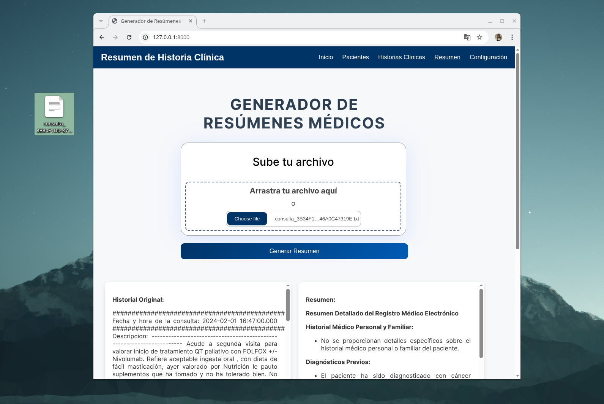

# 🧠 Clinical Summarization with Small Language Models

Este proyecto explora cómo aprovechar **Modelos de Lenguaje Pequeños (SLMs)** para generar resúmenes automáticos de historias clínicas reales.  
En lugar de depender de modelos gigantes como GPT-4, se optimizan modelos más ligeros usando estrategias avanzadas de prompting, **fine-tuning**, y **RAG (Retrieval-Augmented Generation)**.

---

## 🚀 ¿Qué hace este proyecto?

📄 ➜ 🩺 **Convierte historias clínicas largas y desorganizadas en resúmenes claros y útiles.**

Para lograrlo, se desarrolló una pipeline completa con:

- Comparativa de varios **SLMs**, evaluando calidad de resumen y tiempos de inferencia.
- Aplicación de **prompting paso a paso** para mejorar la coherencia.
- Implementación de una arquitectura **RAG con múltiples preguntas** para entender mejor el contexto médico.
- Ajuste fino (**fine-tuning**) del modelo LLaMA 3.2.
- Desarrollo de una **aplicación web interactiva** para generar resúmenes en tiempo real.

---

## ⚙️ Tecnologías principales

- 🧠 Inferencia: Python · PyTorch · Hugging Face · Ollama  
- 🔍 Recuperación y Ajuste Fino: ChromaDB · Unsloth 
- 🌐 Web: FastAPI (backend) + JavaScript (frontend)  
- 💻 Hardware: GPU RTX 3050 Laptop

---

## 💻 Vista previa de la aplicación

La aplicación permite introducir una historia clínica y obtener un resumen automático de manera sencilla.

---

Este proyecto demuestra que los SLMs, con una buena estrategia, pueden ser una solución viable para tareas complejas como el resumen clínico, reduciendo costes y requisitos computacionales.

